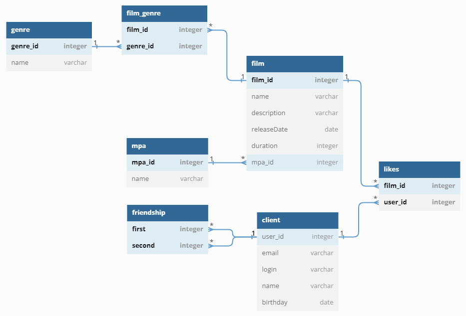

# java-filmorate
Repository of the educational project "FilmoRate"


# Database design
Structure of database is shown in the [ER-diagram](https://dbdiagram.io/d/64499f196b31947051427af1)


sprint peer review held on [28.04](https://docs.google.com/spreadsheets/d/10i_ERbYR9rZNS-Jf6VfJ59J4JjySz9xaCEeCyVkcXLQ/edit#gid=0)
## Components description

*client*: contains information about users

*friendship*: contains information about "friend" interaction between two users

*likes*: contains information about movies liked by users

*film*: contains information about films

*film_genre*: contains information about genres assigned to film

*client*: contains genre names

*mpa*: contains movie genres

## Example of queries for accessing the DB:

Get full information about films (FilmDbStorage method: *findAll*):
``` SQL
SELECT f.*,
       m.name
FROM films AS f 
JOIN mpa AS m ON f.mpa_id = m.mpa_id
```

Get full(*except friends*) information about users (UserDbStorage method: *findAll*):
``` SQL
SELECT u.*
FROM clients AS u
```

Get users friends (UserDbStorage method: *getFriends*):
``` SQL
SELECT second_user_id 
FROM friendship AS f 
WHERE first_user_id = ?
```

Get amount(*sorting*) of likes for a movie (FilmDbStorage method: *getPopularFilms*):
``` SQL
SELECT f.*,
       count (l.user_id) AS count_likes,
       m.name
FROM films AS f
LEFT OUTER JOIN likes AS l ON f.film_id = l.film_id
LEFT OUTER JOIN mpa AS m ON f.mpa_id = m.mpa_id
GROUP BY f.name
ORDER BY count (l.user_id) DESC
LIMIT 10
```

Get a film by id (FilmDbStorage method: *findById*):
``` SQL
SELECT f.*, 
       m.name
FROM films AS f
JOIN mpa AS m ON f.mpa_id = m.mpa_id 
WHERE f.film_id = ?
```